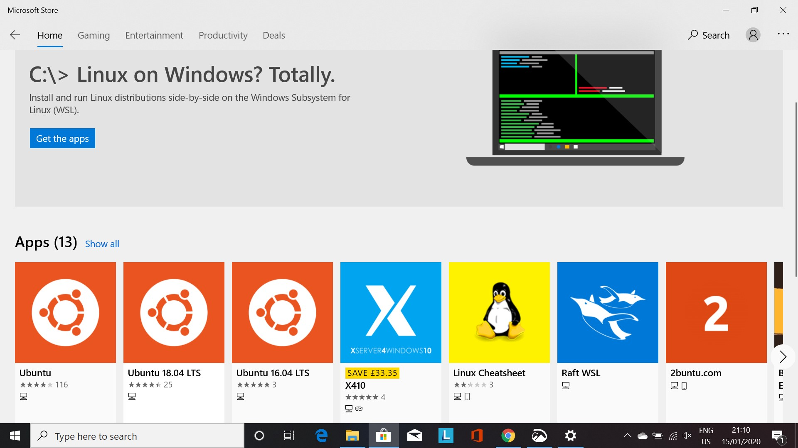
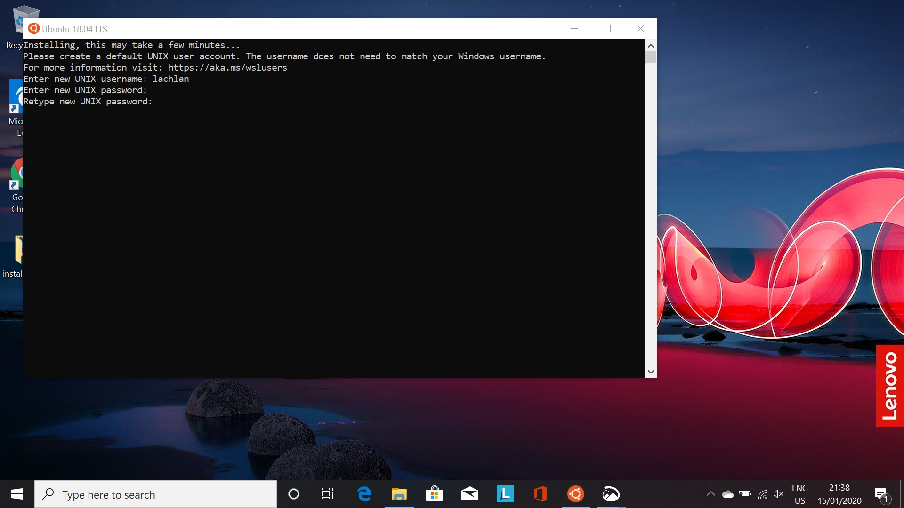
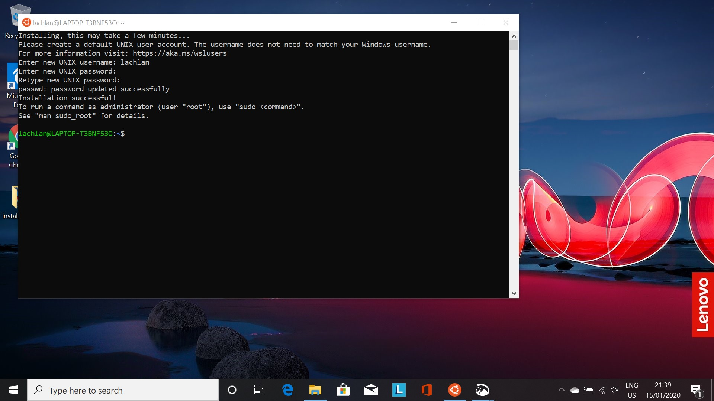

# Windows Subsystem For Linux

!!! tip "Windows Users Only!"

    This page is only for those who are using Windows. Those with Mac or Linux operating systems can proceed to 'Command Line Tools.'

Windows Subsystem for Linux (WSL) is a feature in Windows 10 that enables you to use Linux command-line tools on your Windows system.
By installing this feature, everyone in the course will be able to run the same commands, and get the same output - an essential aspect of reproducibility.
We hope that you will continue to use the WSL features after the course for your research related computing.

The process for installing everything we need here is quite order dependent - follow the steps in the order they appear below.

!!! tip "Want More Information?"

    For more information about the Windows Subsystem for Linux, look [here](https://docs.microsoft.com/en-us/windows/wsl/faq).

!!! warning "Up to Date Windows 10 Required!"

    To go further with this Installation Guide you need to have an up to date installation of Windows 10. 
    IT Services in the Econ Department have assured us, if you update Windows to the latest version in your UZH laptop everything that follows will work. 

    If you do not have a Windows 10 machine. [Contact us!](../contact/#questions-or-comments)

## Install the Windows Subsystem for Linux

As a first step we need to install the Windows Linux Subsystem.
Proceed as follows:

1. Open 'Settings' by searching for it in the search bar

    

2. In Setting, search for 'Apps & features'

    

3. Scroll down and click on 'Programs and Features'

    

4. On the left, click on 'Turn Windows features on or off'

    

5. Scroll down until you see 'Windows Subsystem for Linux' and click the box, and then click 'OK'

    

6. A prompt to restart your PC will appear, click 'Restart now' to restart your PC.

    

## Installing a Linux Distribution

We are going to install 'Ubuntu' as our Linux distribution of choice. 
It is one of the more user friendly choices around. 

Once your PC has rebooted, proceed as follows:

1. Open the Micrsoft Store by searching for it in the search bar

    

2. Search for 'Ubuntu' in the Store search bar and press enter

    

3. Select 'Ubuntu 18.04 LTS' from the choices returned by clicking on it

    

4. Click 'Get' to install

    

5. Once installed, if you open the Windows Menu, you will See 'Ubuntu 18.04 LTS' under 'Recently Added'

    

6. Click on 'Ubuntu 18.04 LTS.' A black terminal will open, and inform you it is installing

    

7. Once installed, it will prompt you to create an account. Enter a username

    

8. And a password (Note: as you enter a password nothing will appear)

    

9. Re-enter the password as instructed

    

10. The installation will now have completed

    

!!! danger "WSL not enabled"

    If at Step 6, you see the following:

    

    This means you have not successfully installed the Windows Subsystem for Linux, or you did not restart your machine as instructed.
    Try to either:

    1. Restart your PC
    2. Return [here](#install-the-windows-subsystem-for-linux) and redo the process.

## Installing Windows Terminal

The terminal that comes with Ubuntu 18.04 LTS out of the box is not our favourite, so we will install something a little better.
Proceed as follows:

(You should be more comfortable installing stuff from the store now, so we will skip the screenshots)

1. Open the Microsoft Store
2. Search for Windows Terminal
3. Choose the first option - Windows Terminal (Preview)
4. Install it by clicking 'Get'
5. Once installed, you will see it under 'Recently Added' in the Windows menu
6. Open Windows Terminal
7. To get access to your Ubuntu system, click the down arrow in the menu bar
8. Select Ubuntu-18.04, and your Ubuntu terminal will open

## The Way Forward

As you proceed through the remainder of the Installation Guide, you will generally follow the steps for 'Linux Users' and enter the commands into the Ubuntu Terminal we just installed.
Occasionally there will be differences between Linux and Windows steps - and these will be clearly marked by a separate header 'Windows Users.' 
