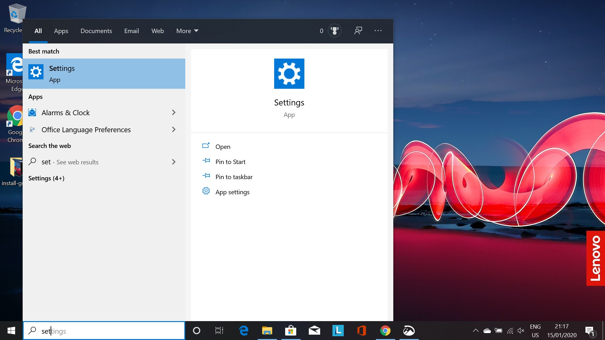
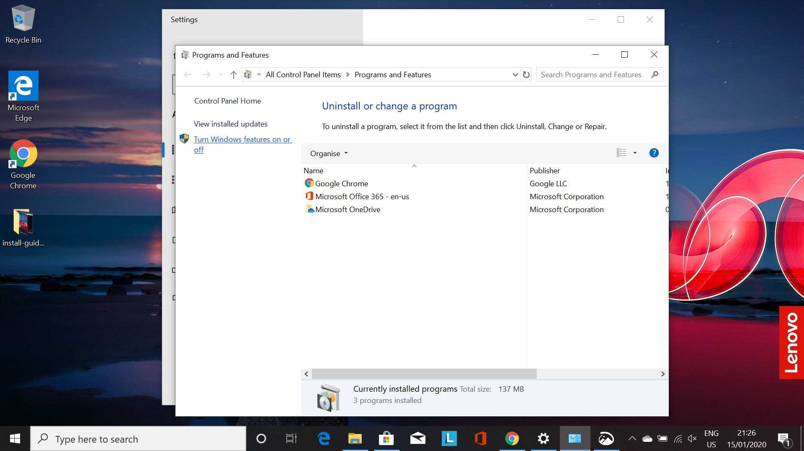

# Windows Subsystem For Linux

!!! tip "Windows Users Only!"

    This page is only for those who are using Windows.

Windows Subsystem for Linux (WSL) is a feature in Windows 10 that enables you to use Linux command-line tools on your Windows system.
By installing this feature, everyone in the course will be able to run the same commands, and get the same output - an essential aspect of reproducibility.
We hope that you will continue to use the WSL features after the course for your research related computing.

The process for installing everything we need here is quite order dependent - follow the steps in the order they appear below.

!!! tip "Want More Information?"

    For more information about the Windows Subsystem for Linux, look [here](https://docs.microsoft.com/en-us/windows/wsl/faq).

!!! warning "Up to Date Windows 10 Required!"

    To go further with this Installation Guide you need to have an up to date installation of Windows 10. 
    IT Services in the Econ Department have assured us, if you update Windows to the latest version in your UZH laptop everything that follows will work. 

    If you do not have a Windows 10 machine. [Contact us!](../contact/#questions-or-comments)

## Install the Windows Subsystem for Linux

As a first step we need to install the Windows Linux Subsystem.
Proceed as follows:

1. Open 'Settings' by searching for it in the search bar

    

2. In Setting, search for 'Apps & features'

    

3. Scroll down and click on 'Programs and Features'

    

4. On the left, click on 'Turn Windows features on or off'

    

5. Scroll down until you see 'Windows Subsystem for Linux' and click the box, and then click 'OK'

    

6. A prompt to restart your PC will appear, click 'Restart now' to restart your PC.

    

## Installing a Linux Distribution

## Installing Windows Terminal
